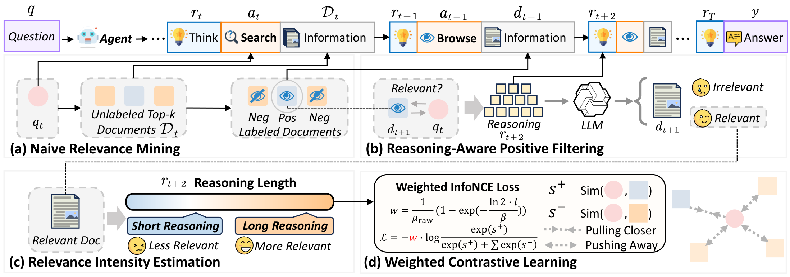

<div align="center">

# Learning to Retrieve from Agent Trajectories
### LRAT

<p>
  
</p>

<p>
  <a href="https://yuqi-zhou.github.io/LRAT-homepage/"></a>
  <a href="https://huggingface.co/collections/Yuqi-Zhou/lrat-learning-to-retrieve-from-agent-trajectories"></a>
  <a href="https://huggingface.co/datasets/Yuqi-Zhou/LRAT-Train"></a>
  <a href="#citation"></a>
</p>

</div>

## Introduction

**LRAT** studies how to train retrievers from the intermediate behaviors of strong search agents rather than from only final answers. The repository focuses on a practical pipeline for:

- collecting long-horizon search trajectories from agentic systems,
- converting trajectories into retrieval supervision,
- training retrievers on the resulting samples, and
- evaluating both retrieval quality and end-to-end task success.

<p align="center">
  
</p>
<p align="center">
  <a href="assets/paper-figures/method_7.pdf">PDF Version</a>
</p>

## News

- `2026/03/24`: Open-sourced [model checkpoints](https://huggingface.co/collections/Yuqi-Zhou/lrat-learning-to-retrieve-from-agent-trajectories) and the [LRAT-Train dataset](https://huggingface.co/datasets/Yuqi-Zhou/LRAT-Train).

## Highlights

- **Trajectory-first retrieval learning**: build retriever supervision from agent search and browse traces instead of relying only on static relevance labels.
- **Agent-friendly data collection**: run local or API-based research agents and save each query as structured trajectory JSON.
- **Training data construction with an LLM judge**: turn trajectories into `(query, pos, neg, ...)` training pairs with reasoning-aware annotations.
- **Benchmark-oriented evaluation**: evaluate outputs on `BrowseComp-Plus` and `InfoSeek-Eval` with a local vLLM judge.

## Resources

| Resource | Status |
| --- | --- |
| Homepage | [Homepage](https://yuqi-zhou.github.io/LRAT-homepage/) |
| Model Checkpoint | [LRAT Collection](https://huggingface.co/collections/Yuqi-Zhou/lrat-learning-to-retrieve-from-agent-trajectories) |
| Dataset Release | [LRAT-Train](https://huggingface.co/datasets/Yuqi-Zhou/LRAT-Train) |
| arXiv Paper | `TODO` |

## Repository Overview

| Path | Description |
| --- | --- |
| `src/` | Core utilities for index construction and trajectory-to-training-data conversion |
| `search_agent/` | Agent clients for Tongyi DeepResearch, WebExplorer, AgentCPM, OpenAI-compatible APIs, and related prompts/utilities |
| `searcher/` | Search backends and local retrieval interfaces |
| `docs/` | Step-by-step documentation for indexing, trajectory construction, training data construction, and evaluation |
| `datasets/` | Benchmark files used in evaluation |
| `topics-qrels/` | Query and qrel files for retrieval experiments |
| `trajectory/` | Example trajectory artifacts |
| `FlagEmbedding/` | Local copy of FlagEmbedding used for retriever training |
| `tevatron/` | Local copy of Tevatron utilities used in dense retrieval workflows |
| `scripts_evaluation/` | Evaluation scripts for end-to-end judging |

## Vendored Dependencies

- `FlagEmbedding/` is a vendored and locally modified copy based on the upstream FlagEmbedding project. In this repository, it reflects user-side modifications layered on top of upstream work and earlier external changes.
- `tevatron/` is a vendored upstream dependency used to support dense retrieval utilities and encoding workflows.
- More details are documented in [THIRD_PARTY_NOTICES.md](THIRD_PARTY_NOTICES.md).

## Supported Components

### Retriever Backends

- `bm25`
- `faiss`

### Agent / LLM Backends

- `Alibaba-NLP/Tongyi-DeepResearch-30B-A3B`
- `hkust-nlp/WebExplorer-8B`
- `openbmb/AgentCPM-Explore`
- `openai/gpt-oss-120b`
- OpenAI-compatible API services such as MiniMax / GLM-style endpoints

## Quick Start

The quickest way to understand the repository is:

1. set up the environment,
2. build a retrieval index,
3. generate agent trajectories,
4. convert trajectories into retriever training data,
5. train a retriever, and
6. run benchmark evaluation.

### 1. Environment Setup

```bash
# Install uv
curl -LsSf https://astral.sh/uv/install.sh | sh

# Sync environment
uv sync

# Optional: activate the environment
source .venv/bin/activate

# Install flash-attn if needed by your environment
uv pip install --no-build-isolation flash-attn
```

Install Java 21 for the Lucene / Pyserini-based BM25 pipeline:

```bash
conda install -c conda-forge openjdk=21
```

Install the local FlagEmbedding package:

```bash
cd FlagEmbedding
pip install -e .
cd ..
```

### 2. Build Retrieval Indexes

See [docs/index.md](docs/index.md) for the full indexing notes.

BM25 template:

```bash
python src/index_builder.py \
  --retrieval_method bm25 \
  --corpus_path /path/to/your/corpus.jsonl \
  --save_dir /path/to/save/index
```

Dense embedding template via Tevatron:

```bash
CUDA_VISIBLE_DEVICES=0 python -m tevatron.retriever.driver.encode \
  --model_name_or_path /path/to/your/embedding_model \
  --dataset_path /path/to/your/corpus.jsonl \
  --encode_output_path /path/to/save/embeddings.pkl \
  --passage_max_len 512 \
  --normalize \
  --pooling <eos|mean> \
  --passage_prefix "" \
  --per_device_eval_batch_size 512 \
  --padding_side left \
  --fp16
```

### 3. Generate Agent Trajectories

See [docs/trajectory_construction.md](docs/trajectory_construction.md) for full examples.

Example with `Tongyi` and a `bm25` backend:

```bash
python search_agent/tongyi_client.py \
  --output-dir /path/to/output/dir \
  --searcher-type bm25 \
  --index-path /path/to/bm25/index/dir \
  --num-threads 32 \
  --model /path/to/agent_or_llm_dir \
  --snippet-max-tokens 64 \
  --query /path/to/queries.tsv \
  --port <PORT> \
  --k 10
```

Example with `Tongyi` and a `faiss` backend:

```bash
python search_agent/tongyi_client.py \
  --output-dir /path/to/output/dir \
  --searcher-type faiss \
  --index-path "/path/to/embeddings/index-*.pkl" \
  --model-name /path/to/embedding/model \
  --pooling <mean|eos> \
  --normalize \
  --num-threads 32 \
  --snippet-max-tokens 64 \
  --query /path/to/queries.tsv \
  --port <PORT> \
  --dataset-name /path/to/corpus_or_dataset \
  --model /path/to/agent_or_llm_dir \
  --k 10
```

### 4. Build Training Data from Trajectories

See [docs/training_data_construction.md](docs/training_data_construction.md).

If you do not want to build training data from scratch, you can directly use the released [LRAT-Train](https://huggingface.co/datasets/Yuqi-Zhou/LRAT-Train) dataset. If you prefer to control filtering or supervision design yourself, you can also start from saved agent trajectories and rerun pair extraction with `src/data_builder.py`.

```bash
python src/data_builder.py \
  --corpus-path /path/to/your/corpus.jsonl \
  --traj-dir /path/to/your/trajectory_dir \
  --output-path /path/to/save/output.jsonl \
  --tokenizer-path /path/to/your/tokenizer_or_model_dir \
  --judge-api-url http://<JUDGE_HOST>:<PORT>/v1/chat/completions \
  --judge-model <JUDGE_MODEL_NAME> \
  --max-workers 32 \
  --future-timeout 30
```

### 5. Train the Retriever

The repository currently uses the local `FlagEmbedding` training recipe. Start from:

- [FlagEmbedding/examples/finetune/embedder/run.sh](FlagEmbedding/examples/finetune/embedder/run.sh)
- [FlagEmbedding/examples/finetune/embedder/README.md](FlagEmbedding/examples/finetune/embedder/README.md)

You can plug the JSONL generated by `src/data_builder.py` into your existing training setup without changing the repository-level presentation structure.

### 6. Evaluate End-to-End Performance

See [docs/evaluate.md](docs/evaluate.md).

```bash
python scripts_evaluation/evaluate.py \
  --input_dir /path/to/agent_output_json_dir \
  --gt_path /path/to/InfoSeek-Eval.tsv \
  --dataset_type InfoSeek-Eval \
  --output_file /path/to/save/eval_results.json \
  --model_path /path/to/local_judge_model \
  --tensor_parallel_size <NUM_GPUS> \
  --gpu_memory_utilization <GPU_MEM_UTIL> \
  --batch_size 32
```

## Documentation

| Topic | Link |
| --- | --- |
| Index Construction | [docs/index.md](docs/index.md) |
| Trajectory Construction | [docs/trajectory_construction.md](docs/trajectory_construction.md) |
| Training Data Construction | [docs/training_data_construction.md](docs/training_data_construction.md) |
| Minimal Reproduction | [docs/minimal_repro.md](docs/minimal_repro.md) |
| Experiment Layout | [docs/experiment_layout.md](docs/experiment_layout.md) |
| Segmented Training Data Experiments | [docs/segmented_training_data_experiment.md](docs/segmented_training_data_experiment.md) |
| Evaluation | [docs/evaluate.md](docs/evaluate.md) |

## Data and Outputs

- Example benchmark files are stored in `datasets/`.
- Query and qrel files are stored in `topics-qrels/`.
- Example trajectory outputs are stored in `trajectory/`.
- Generated run artifacts are saved as one JSON file per query by the agent clients.

## Acknowledgements

This repository builds on and benefits from several excellent open-source projects and public resources:

- [Alibaba-NLP/DeepResearch](https://github.com/Alibaba-NLP/DeepResearch)
- [openclaw/openclaw](https://github.com/openclaw/openclaw)
- [FlagOpen/FlagEmbedding](https://github.com/FlagOpen/FlagEmbedding)
- [texttron/BrowseComp-Plus](https://github.com/texttron/BrowseComp-Plus)
- [Tevatron](https://github.com/texttron/tevatron)

## License

This repository is released under the Apache License 2.0. See [LICENSE](LICENSE).

Vendored components keep their own upstream licenses, especially:

- `FlagEmbedding/` under its upstream MIT license
- `tevatron/` under Apache License 2.0

## Citation

If you find this repository useful, you can use the following placeholder citation for now and update it after the paper is uploaded to arXiv:

```bibtex
@misc{lrat2026,
  title        = {Learning to Retrieve from Agent Trajectories},
  author       = {TODO},
  year         = {2026},
  howpublished = {Manuscript in preparation},
  note         = {Project page, checkpoint, dataset, and arXiv link will be released later}
}
```
