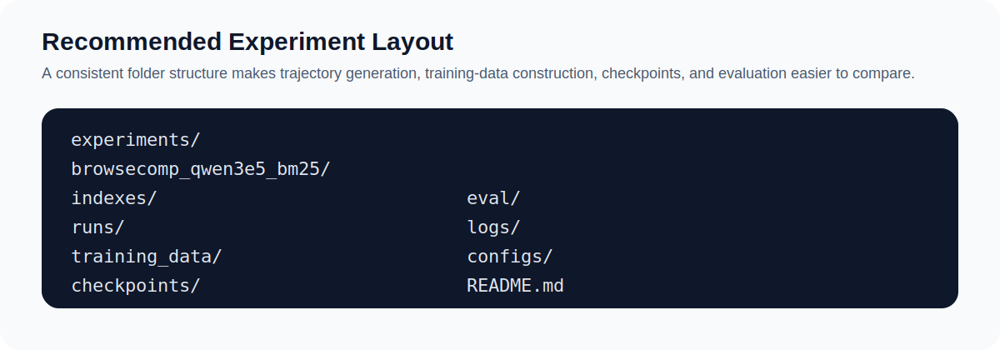

# Recommended Experiment Layout

This repository becomes much easier to manage once indexes, trajectories, training data, checkpoints, and evaluation outputs follow one predictable directory structure.

<p align="center">
  
</p>

## Recommended Layout

```text
experiments/
  <exp_name>/
    indexes/
    runs/
    training_data/
    checkpoints/
    eval/
    logs/
    configs/
    README.md
```

## What Each Folder Should Hold

- `indexes/`: BM25 indexes or dense embedding shards
- `runs/`: agent trajectory JSON outputs
- `training_data/`: generated JSONL files for retriever training
- `checkpoints/`: trained retriever checkpoints
- `eval/`: evaluation JSON files, score tables, and small summaries
- `logs/`: script logs, merge summaries, training-data stats
- `configs/`: query TSV files, model names, shell snippets, and experiment settings
- `README.md`: one short note describing what this experiment changed

## Naming Convention

Use an experiment name that encodes:

- dataset
- retriever backbone
- search backend
- agent
- any major variant

Example:

```text
experiments/
  browsecomp_qwen3e5_tongyi_bm25/
  browsecomp_qwen3e5_tongyi_faiss/
  infoseek_qwen3e5_openai_segmented/
```

## Suggested Run Subfolders

If you compare multiple agents or retrieval modes under one experiment root:

```text
runs/
  tongyi_bm25/
  tongyi_faiss/
  webexplorer_faiss/
  openai_api_faiss/
```

## Suggested Training-Data Subfolders

```text
training_data/
  full.jsonl
  segmented/
    front30.jsonl
    middle30.jsonl
    back30.jsonl
    full100.jsonl
    mix_final.jsonl
```

## Suggested Evaluation Outputs

```text
eval/
  tongyi_bm25_infoseek.json
  tongyi_faiss_infoseek.json
  summary.md
```

## Rule of Thumb

Every experiment directory should be self-explanatory enough that you can come back later and answer:

- what model was used,
- what data was used,
- what changed relative to the previous run, and
- where the resulting trajectories, training data, and scores were saved.
