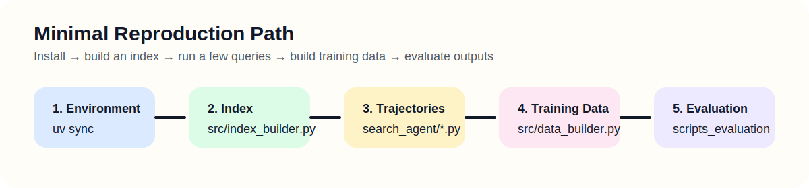

# Minimal Reproduction

This is the shortest recommended path to verify that the repository is wired correctly end to end.

<p align="center">
  
</p>

## Goal

Run a very small experiment that confirms:

1. the environment is usable,
2. a retriever index can be built,
3. an agent client can save trajectory JSON files,
4. those trajectories can be converted into training data, and
5. evaluation can read the saved outputs.

## Prerequisites

- a working Python environment
- a local corpus
- either a local model served by vLLM or an OpenAI-compatible API endpoint
- a small TSV query file

## Step 1. Prepare the Environment

```bash
uv sync
source .venv/bin/activate
cd FlagEmbedding
pip install -e .
cd ..
```

If you use BM25, make sure Java 21 is available.

## Step 2. Build One Index

For the fastest sanity check, use a single retrieval backend first.

### Option A: BM25

```bash
python src/index_builder.py \
  --retrieval_method bm25 \
  --corpus_path /path/to/your/corpus.jsonl \
  --save_dir experiments/minimal_demo/indexes
```

### Option B: Dense Retrieval

```bash
CUDA_VISIBLE_DEVICES=0 python -m tevatron.retriever.driver.encode \
  --model_name_or_path /path/to/your/embedding_model \
  --dataset_path /path/to/your/corpus.jsonl \
  --encode_output_path experiments/minimal_demo/indexes/index-000.pkl \
  --passage_max_len 512 \
  --normalize \
  --pooling eos \
  --passage_prefix "" \
  --per_device_eval_batch_size 64 \
  --padding_side left \
  --fp16
```

## Step 3. Prepare a Tiny Query File

Use a TSV with just a few rows:

```text
0<TAB>Your first test question
1<TAB>Your second test question
2<TAB>Your third test question
```

Save it as:

```text
experiments/minimal_demo/configs/queries.tsv
```

## Step 4. Generate Trajectories

Example with the Tongyi client and BM25:

```bash
python search_agent/tongyi_client.py \
  --output-dir experiments/minimal_demo/runs/tongyi_bm25 \
  --searcher-type bm25 \
  --index-path experiments/minimal_demo/indexes/bm25 \
  --query experiments/minimal_demo/configs/queries.tsv \
  --model /path/to/your/model \
  --port <PORT> \
  --num-threads 2 \
  --snippet-max-tokens 64 \
  --k 5
```

If you prefer a dense setup, swap in the FAISS arguments used in [trajectory_construction.md](./trajectory_construction.md).

## Step 5. Build Training Data

```bash
python src/data_builder.py \
  --corpus-path /path/to/your/corpus.jsonl \
  --traj-dir experiments/minimal_demo/runs/tongyi_bm25 \
  --output-path experiments/minimal_demo/training_data/full.jsonl \
  --tokenizer-path /path/to/your/tokenizer_or_model \
  --judge-api-url http://<JUDGE_HOST>:<PORT>/v1/chat/completions \
  --judge-model <JUDGE_MODEL> \
  --max-workers 2 \
  --future-timeout 30
```

## Step 6. Evaluate Saved Outputs

If you have a matching ground-truth TSV, run:

```bash
python scripts_evaluation/evaluate.py \
  --input_dir experiments/minimal_demo/runs/tongyi_bm25 \
  --gt_path /path/to/your/ground_truth.tsv \
  --dataset_type InfoSeek-Eval \
  --output_file experiments/minimal_demo/eval/results.json \
  --model_path /path/to/your/local_judge_model \
  --tensor_parallel_size 1 \
  --gpu_memory_utilization 0.8 \
  --batch_size 4
```

## What to Check

- Did trajectory JSON files appear in `runs/`?
- Does the training JSONL contain non-empty `pos` and `neg` fields?
- Does the evaluation JSON contain `metrics` and `details`?

## Logging

You can make the script output more detailed logs with:

```bash
export LRAT_LOG_LEVEL=DEBUG
```
